

# ⚡ PsychoVertexMaster — Free Blender Productivity Add-on

### Your everyday Blender tools—closer, faster, and easier to use.

  
  
  
  

**PsychoVertexMaster is a free, open-source Blender productivity add-on for faster 3D modeling, modifier setup, UV management, vertex-color editing, collision creation, asset preparation, and batch FBX export.**

Built for Blender artists and game-asset creators, it combines context-aware pie menus, modeling utilities, one-click modifier tools, UV helpers, Unreal Engine workflow helpers, and scene-organization tools in one lightweight package.

Press a key. Pick an action. Stay in the flow.

---

## Table of contents

- [Why this Blender add-on?](#why-this-blender-add-on)
- [Blender tools at a glance](#blender-tools-at-a-glance)
- [Quick start](#quick-start)
- [Blender Handy Menu](#blender-handy-menu)
  - [Blender Edit Mode tools](#blender-edit-mode-tools)
  - [Blender Object Mode tools](#blender-object-mode-tools)
- [Blender Modifier Menu](#blender-modifier-menu)
- [Blender UV management tools](#blender-uv-management-tools)
- [Blender vertex-color tools](#blender-vertex-color-tools)
- [Blender collision generator](#blender-collision-generator)
- [Blender origin and parenting tools](#blender-origin-and-parenting-tools)
- [Blender Asset Browser tools](#blender-asset-browser-tools)
- [Blender FBX import and batch export](#blender-fbx-import-and-batch-export)
- [Custom lightmapping workflow](#custom-lightmapping-workflow)
- [Child Control](#child-control)
- [Preferences](#preferences)
- [Installation](#installation)
- [Optional integrations](#optional-integrations)
- [FAQ](#faq)
- [Contributing](#contributing)
- [License](#license)

---

## Why this Blender add-on?

Blender is powerful, but common actions are often spread across menus, panels, and shortcuts. PsychoVertexMaster gathers them into a compact toolkit designed around how artists actually work.

| Without it | With PsychoVertexMaster |
| --- | --- |
| Search through several menus | Open one context-aware menu |
| Repeat setup on every object | Apply actions across a selection |
| Build modifier stacks manually | Create configured modifiers in a click |
| Manage matching UV layers one object at a time | Update selected objects together |
| Leave Edit Mode for small utility jobs | Measure, color, select, and prepare in place |

### The idea is simple

> Keep your attention on the model—not on finding the next button.

PsychoVertexMaster does not replace Blender's tools. It makes the best everyday ones faster to reach and adds focused helpers for the repetitive gaps between them.

---

## Blender tools at a glance

| Category | Included tools |
| --- | --- |
| **Blender pie menus** | Context-aware Edit Mode and Object Mode actions from the <kbd>D</kbd> shortcut |
| **Modifier workflow** | Mirror, Array, Boolean, Shrinkwrap, Curve, Bevel, Solidify, Skin, and stack controls |
| **Mesh modeling** | Seams, sharp edges, normals, edge flow, checker removal, material assignment, and measurements |
| **UV tools** | UV-map reordering plus batch add, remove, activate, and rename actions |
| **Vertex colors** | Interactive HSV painting, matching-color selection, and hex copy/paste |
| **Game-asset tools** | Fitted box collisions, collision display, Asset Browser creation, and Unreal helpers |
| **Blender export tools** | Quick FBX access and separate `SM_` batch FBX export |
| **Scene organization** | Empty-parent workflows, origin alignment, child controls, and display toggles |
| **Custom lightmapping** | Batch preparation, shared UV packing, Cycles baking, optional denoising, filler replacement, and EXR output |
| **Configurable menus** | Independent Edit Mode, Object Mode, and no-selection layouts with reusable custom entries |

Whether you are searching for a **Blender modeling add-on**, a faster **Blender pie menu**, better **UV workflow tools**, or practical **game asset creation tools**, PsychoVertexMaster keeps the most useful actions together.

---

## Quick start

| Shortcut | Menu | Best for |
| :---: | --- | --- |
| <kbd>D</kbd> | **Handy Menu** | Context-aware modeling, object, UV, color, collision, asset, and export actions |
| <kbd>W</kbd> | **Modifier Menu** | Quickly adding and managing common modifiers |

The Handy Menu changes with Blender's current mode. Edit a mesh and it shows mesh tools. Return to Object Mode and it shows organization, display, asset, and export tools.

Prefer lists over radial menus? Switch from **Pie Menus** to **Normal Menus** in the add-on preferences.

---

## Blender Handy Menu

<table>
  <tr>
    <td align="center">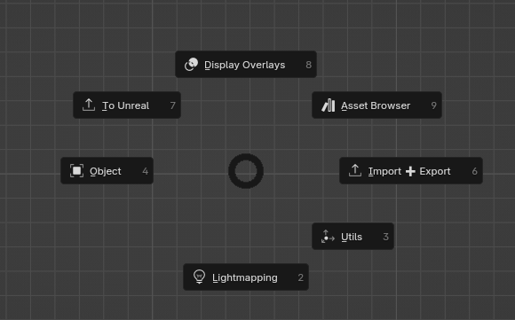 <strong>Object Mode</strong></td>
    <td align="center">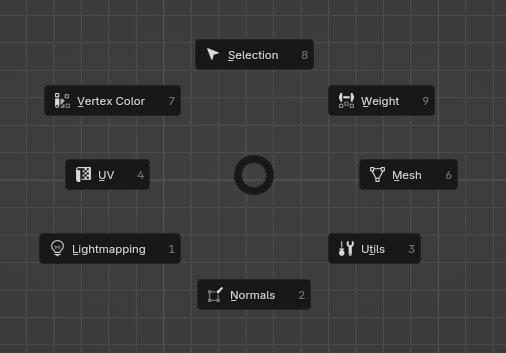 <strong>Edit Mode</strong></td>
  </tr>
</table>

One shortcut, two context-aware layouts, dozens of useful Blender actions.

The <kbd>D</kbd> menu is the center of PsychoVertexMaster. It groups actions by purpose and only shows the groups relevant to your current context.

## Blender Edit Mode tools

### 🟦 UV tools

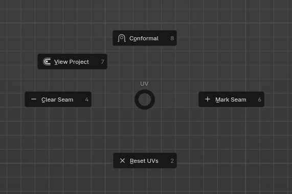

| Action | What it does |
| --- | --- |
| **Mark Seam** | Marks selected edges as UV seams. |
| **Clear Seam** | Removes the seam flag from selected edges. |
| **Conformal Unwrap** | Runs Blender's unwrap operation using the menu's prepared action. |
| **Project From View** | Projects selected geometry from the current viewport without forcing it to the UV bounds. |
| **Reset UVs** | Resets the UV coordinates of selected faces. |

### 🟧 Mesh tools

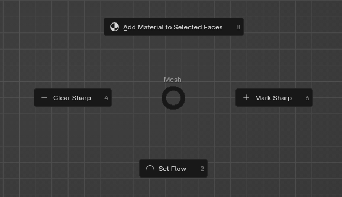

| Action | What it does |
| --- | --- |
| **Mark Sharp / Clear Sharp** | Adds or removes sharp-edge flags from the selection. |
| **Set Flow** | Uses EdgeFlow to reshape selected edge loops into a smoother flow when the integration is installed. |
| **Remove Checker** | Dissolves a repeating checker pattern from selected edge loops, processed per mesh island. Skip, step, and offset remain adjustable in the operator panel. |
| **Add Material to Selected Faces** | Copies the active material into a new slot and assigns that copy to the selected faces. |

### 🟩 Selection tools

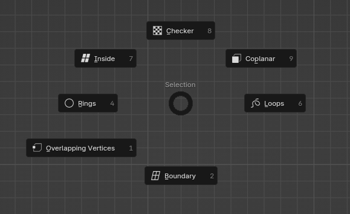

| Action | What it does |
| --- | --- |
| **Rings / Loops** | Expands the current edge selection into rings or loops. |
| **Boundary** | Converts a selected region to its boundary loop. |
| **Inside** | Converts a boundary loop back to its enclosed region. |
| **Checker** | Applies Blender's checker deselection to the current selection. |
| **Coplanar** | Selects faces similar to the active face by coplanarity. Appears in Face Select mode. |
| **Overlapping Vertices** | Finds vertices occupying the same or nearly the same position. Adjust the threshold and choose whether all matching vertices are selected. |

### 🟪 Normals and face strength

<table>
  <tr>
    <td>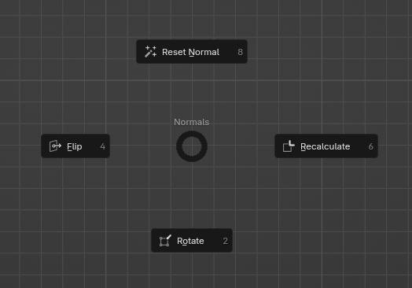</td>
    <td>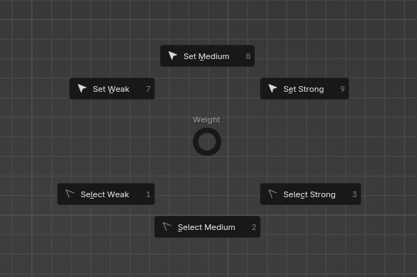</td>
  </tr>
  <tr>
    <td align="center"><strong>Normal editing</strong></td>
    <td align="center"><strong>Face strength</strong></td>
  </tr>
</table>

| Action | What it does |
| --- | --- |
| **Flip** | Flips the selected normals. |
| **Recalculate** | Recalculates normals for consistent orientation. |
| **Rotate** | Opens Blender's normal rotation tool. |
| **Reset Normal** | Resets custom normals on the selection. |
| **Set Weak / Medium / Strong** | Assigns weighted-normal face strength and creates a configured Weighted Normal modifier when needed. |
| **Select Weak / Medium / Strong** | Selects faces by their weighted-normal face strength. |

### 🟥 Editing utilities

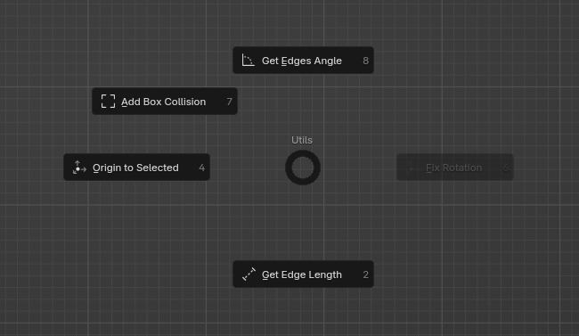

| Action | What it does |
| --- | --- |
| **Origin to Selected** | Moves the object's origin to the selected mesh elements while preserving the object in the scene. |
| **Fix Rotation** | Sets the origin from the selection and aligns the object's rotation through the helper workflow. |
| **Get Edge Length** | Reports the active edge length and the total length of all selected edges using the scene's unit settings. |
| **Get Edges Angle** | Reports the smallest angle between exactly two selected edges. |
| **Add Box Collision** | Builds a fitted collision box from at least three selected vertices. See [Blender collision generator](#blender-collision-generator). |

### 🎨 Vertex-color tools

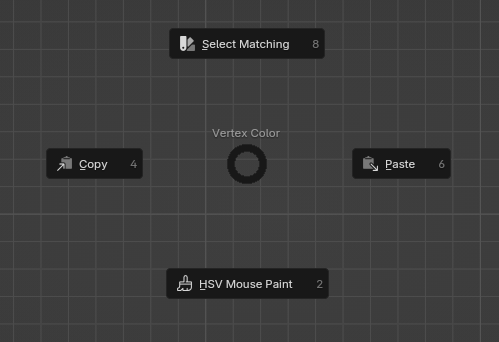

| Action | What it does |
| --- | --- |
| **HSV Mouse Paint** | Opens a fast saturation/value square with a hue strip around the mouse. Click or drag either control to choose a color, click outside to confirm, or right-click/Esc to cancel. |
| **Select Matching** | Selects faces whose active color matches the active face. |
| **Copy** | Averages the active face color and copies it to the clipboard as `#RRGGBB`. |
| **Paste** | Reads a hex color from the clipboard and applies it to all selected faces. |

---

## Blender Object Mode tools

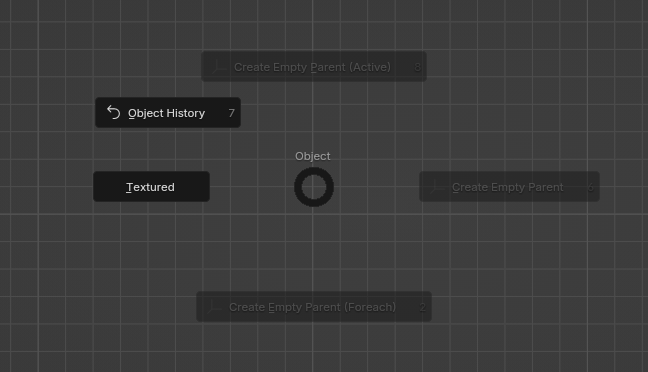

### 🟦 Object display and organization

| Action | What it does |
| --- | --- |
| **Display Type** | Changes the active object's viewport display style. |
| **Auto Smooth** | Toggles the mesh's smoothing option where supported by the Blender version. |
| **Create Empty Parent** | Creates an empty at the active object's location and parents the selected objects while preserving transforms. |
| **Create Empty Parent (Foreach)** | Creates a separate empty for every selected object and renames the mesh with a `_Mesh` suffix. |
| **Create Empty Parent (Active)** | Uses the active object's name for one shared parent and adds `_Mesh` to selected child names. |

### 🟩 Copy and alignment helpers

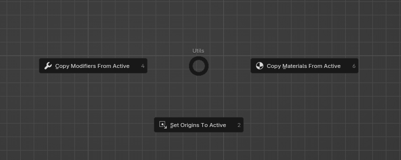

| Action | What it does |
| --- | --- |
| **Copy Modifiers From Active** | Uses Blender's data-linking operation to copy the active object's modifiers to the other selected objects. |
| **Copy Materials From Active** | Copies the active object's material links to the other selected objects. |
| **Set Origins To Active** | Moves the selected objects' origins to the active object's location and rotation via the 3D cursor. |

### 🟧 Viewport controls

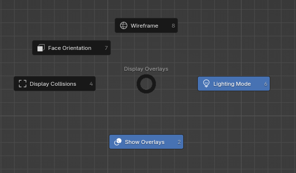

Toggle these without opening the Overlays popover:

- all viewport overlays;
- wireframe overlay;
- face-orientation overlay;
- generated collision visibility.

### 🟪 Optional Object History entry

If a compatible panel named `DATA_PT_PsychoHistory_KM` is registered, PsychoVertexMaster adds an **Object History** shortcut automatically. If it is not available, the entry stays hidden.

---

## Blender Modifier Menu

Press <kbd>W</kbd> in the 3D View to create and manage modifiers with fewer setup steps.

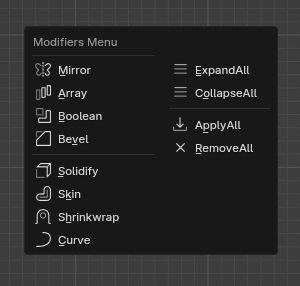

### Add modifiers

| Modifier | Available behavior |
| --- | --- |
| **Mirror** | Adds a Mirror modifier on `X`, `Y`, `Z`, `XY`, `YZ`, `XZ`, or `XYZ`; enables clipping and uses a small merge threshold. |
| **Array** | Adds an array by fixed count, fit length, selected curve, or object offset. |
| **Boolean** | Adds an empty Boolean modifier to selected objects, or adds Boolean modifiers to the active object using the other selected objects as cutters. Cutters switch to wire display. |
| **Shrinkwrap** | Adds an empty Shrinkwrap modifier, or uses the active object as the target for the other selected objects. |
| **Curve** | Adds an empty Curve modifier or assigns a selected curve to the active object, with an option to move the object to the curve. |
| **Bevel** | Adds a Bevel modifier to every selected object. |
| **Solidify** | Adds a Solidify modifier to every selected object. |
| **Skin** | Adds a Skin modifier to every selected object. |

### Manage modifier stacks

| Action | What it does |
| --- | --- |
| **Expand All** | Expands every modifier panel on selected objects. |
| **Collapse All** | Collapses every modifier panel on selected objects. |
| **Apply All** | Applies every modifier on each selected object. |
| **Remove All** | Removes every modifier from each selected object. |

> **Tip:** Apply All and Remove All change complete modifier stacks. Save first when working on important assets.

---

## Blender UV management tools

PsychoVertexMaster extends the UV Maps panel in **Object Data Properties**. These controls are designed for selections containing several meshes that should share the same UV-layer structure.

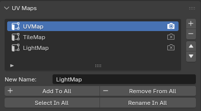

| Action | How it works |
| --- | --- |
| **Move Up / Move Down** | Reorders the active UV map in the list. |
| **Add To All** | Creates the name entered in **New Name** on every selected object that does not already have it. |
| **Remove From All** | Removes the active UV-map name from every selected object that contains it. |
| **Select In All** | Makes the matching UV map active across selected objects. |
| **Rename In All** | Renames matching active UV maps across the selection. |

This is especially useful when several meshes must agree on names such as `UVMap`, `Detail`, or another pipeline convention.

---

## Blender vertex-color tools

Vertex colors become a practical modeling tool instead of a panel-hunting exercise.

### HSV Mouse Paint workflow

1. Enter Edit Mode and select vertices, edges, or faces.
2. Press <kbd>D</kbd> and open **Vertex Color → HSV Mouse Paint**.
3. Click or drag across the large square to set saturation and value.
4. Click or drag across the side strip to set hue.
5. Click outside the picker to accept or press <kbd>Esc</kbd> to cancel.

The tool temporarily switches viewport shading so the color is visible, supports point- and corner-domain color attributes, creates a `Color` corner attribute when necessary, and restores the previous display afterward.

### Copy, paste, and match

- **Copy** turns the active face's average color into a portable hex value.
- **Paste** accepts `#RRGGBB` or `RRGGBB` from the clipboard.
- **Select Matching** finds faces with the same byte-level color as the active face.

---

## Blender collision generator

Create Unreal-compatible collision helpers from a mesh selection in Edit Mode or from selected meshes in Object Mode:

| Tool | Output | Best for |
| --- | --- | --- |
| **Add Box Collision** | `UBX_` | Box-like forms using axis-aligned or PCA-oriented fitting. |
| **Add Sphere Collision** | `USP_` | Rounded objects using a fitted sphere. |
| **Add Capsule Collision** | `UCP_` | Elongated rounded forms using a fitted capsule. |
| **Add Convex Collision** | `UCX_` | Irregular forms using a convex hull. |

For example, select at least three vertices in Edit Mode and run **Add Box Collision**. The tool:

1. analyzes the selected points;
2. compares an axis-aligned box with a PCA-oriented box;
3. uses the rotated result only when it provides a confident, meaningful improvement;
4. adds adjustable padding;
5. creates a separate collision object in the source collection;
6. converts it through the configured box-collision operation;
7. restores the original object and Edit Mode.

Use **Display Collisions** from the Handy Menu to switch recognized `UBX_`, `UCX_`, `UCP_`, and `USP_` collision objects between visible solid display and hidden/wire display.

---

## Blender origin and parenting tools

PsychoVertexMaster includes several ways to organize transforms without rebuilding hierarchies manually.

| Tool | Best use |
| --- | --- |
| **Origin to Selected** | Place an object's pivot at chosen mesh geometry. |
| **Fix Rotation** | Derive a more useful origin and rotation from a mesh selection. |
| **Set Origins To Active** | Give several objects the same pivot location and rotation as the active object. |
| **Create Empty Parent** | Group the selection around the active object's transform. |
| **Create Empty Parent (Foreach)** | Wrap every selected mesh in its own named parent. |
| **Create Empty Parent (Active)** | Create one named root from the active object for the entire selection. |

---

## Blender Asset Browser tools

**Make Collection Assets** turns selected objects into individual collection assets:

- creates or reuses a collection named after each object;
- moves the object into that collection;
- marks the collection as an asset;
- generates an asset preview;
- removes the old collection when it becomes empty.

It is a fast way to convert scene objects into reusable library pieces.

---

## Blender FBX import and batch export

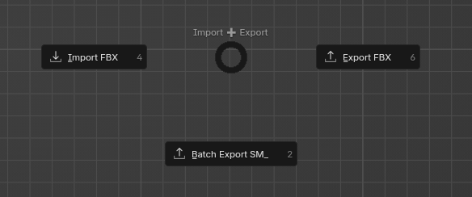

### Standard FBX access

The Handy Menu exposes Blender's regular **Import FBX** and **Export FBX** actions near the rest of the asset-preparation tools.

### Batch Export Selections as `SM_`

This helper exports every selected object as a separate FBX file:

- output names follow `SM_ObjectName.fbx`;
- each object is exported individually;
- location and rotation are temporarily cleared for export;
- the operation uses Blender's FBX exporter;
- an undo step restores the working scene afterward.

### Blender for Unreal helpers

When Blender for Unreal is installed, the **To Unreal** menu can:

- prepare selected objects for recursive export;
- set or clear export status;
- update export paths from collection hierarchy;
- configure collision, material search, rotation, Nanite, and light-map export properties used by that integration.

---

## Child Control

The **Child Control** panel lives in the 3D View sidebar. For selected parent objects, it groups direct children by the prefix before `_` and provides quick controls to:

- toggle a child hierarchy's viewport visibility;
- select a visible child;
- open Blender's rename panel for that child.

Children inside collections that disable selection are omitted, keeping protected scene structures out of the panel.

---

## Custom lightmapping workflow

PsychoVertexMaster includes a batch-oriented lightmapping pipeline for preparing Blender assets, sharing a packed `LightMap` UV space, baking Cycles lighting, denoising the result, assigning final EXR lightmaps, and preparing generated assets for Unreal Engine workflows.

### Feature overview

- Treat each direct child of a top-level `SOURCE` collection as one independent bake batch.
- Realize collection instances while preserving object hierarchies, lights, collision helpers, material-slot order, and shadow-visibility behavior.
- Pack eligible meshes together with per-face `lightmap_scale` control and optional pixel-perfect UV alignment.
- Bake multiple receivers into one persistent full-resolution noisy EXR per batch.
- Denoise before or after premultiplied downsampling, with controllable final-pixel margins.
- Use Blender's integrated denoiser, Open Image Denoise, the supported OptiX executable, or no denoising.
- Replace repeated filler instances from prepared batches without adding them to later bakes.
- Export each prepared logical asset once as FBX plus one versioned scene-placement JSON for Unreal.
- Preview baked lighting and clean either one generated batch or the complete generated workspace.

### Requirements

- Blender 4.2 or newer for the complete workflow. Passthrough materials use the Ray Portal BSDF introduced in Blender 4.2.
- [UVPackmaster 3](https://uvpackmaster.com/) for the custom UV packing operations.
- A saved `.blend` file and permission to write its `Lightmaps` directory.
- Mesh receivers with a UV layer named `LightMap`.
- Materials explicitly marked for light baking, passthrough, or full transparency as needed.
- For external denoising, either use the preference download buttons or choose compatible executables manually.

### Basic workflow

1. Create `SOURCE`; make each direct child collection a separate intended bake batch.
2. Add a `LightMap` UV layer to meshes that should receive baked lighting and configure their material light-baking roles.
3. Optionally set per-face lightmap scale in Edit Mode; `1` is normal density and `0` removes useful lightmap area.
4. Run **Unpack Collections** to generate prepared `EXPORT_STUFF/BatchN` collections and pack their UVs.
5. Activate a generated batch in the Outliner and run **Bake Batch**.
6. Keep that batch active and run **Denoise Batch** to write and assign its final lightmap.
7. Run **Export Unreal Scene** and choose an output folder. FBX geometry and canonical placements come from `EXPORT_STUFF/BatchN`; filler placements come from each batch's paired `FILLERS/F_X` collection, so generated filler replacement is not required for scene reconstruction.
8. Manually import/configure the FBXs in Unreal and reconstruct the open level with the bundled UE 5.6 editor plugin.

See the **[complete lightmapping guide](LIGHTMAPPING_WORKFLOW.md)** for collection setup, material roles, packing controls, baking, denoising, fillers, troubleshooting, and cleanup behavior.

### Where to find the controls

- Press <kbd>D</kbd> or <kbd>W</kbd> in the 3D View and open **Lightmapping**.
- Edit Mode provides **Set Lightmap Scale** and **Scaled UV Packing**.
- Object Mode—or no active object—provides unpack, repack, bake, denoise, filler, and cleanup operations.
- Open **Material Properties → Light Baking** to choose **Light Baked**, **Passthrough**, or **Fully Transparent**. Choose only one role per material.
- Batch-sensitive operations use the active collection in the Outliner, not merely the selected object.

---

## Preferences

Open **Edit → Preferences → Add-ons → PsychoVertexMaster**.

| Mode | Experience |
| --- | --- |
| **Pie Menus** | Fast radial navigation designed for muscle memory. This is the default. |
| **Normal Menus** | A conventional multi-column layout for users who prefer visible lists. |

### Menu configuration

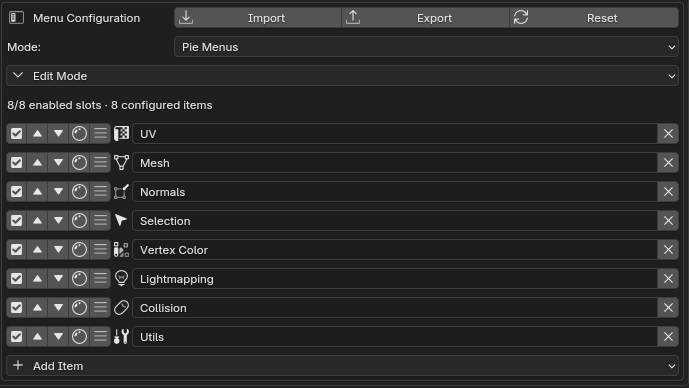

Customize independent Handy Menu layouts for **Edit Mode**, **Object Mode**, and **No Active Object**. Each context can contain up to eight enabled slots while retaining additional disabled entries for later use.

- Reorder, enable or disable, and remove entries directly from each row.
- Rename custom entries and choose their Blender icons with the visual icon picker.
- Open and edit nested submenus through the breadcrumb navigation.
- Add built-in PsychoVertexMaster actions, custom Blender operators, safe property controls, separators, or submenus.
- Import, export, or reset the complete menu configuration with the header controls.

Layouts persist in Blender's add-on preferences. Import and export use JSON files for backup or transfer. The eight-slot limit applies only to enabled entries in each individual menu; additional entries may remain configured but disabled.

The shipped layout stores ordinary Blender operators and RNA properties as editable custom entries, keeping **Plugin Action** focused on PsychoVertexMaster and curated integration features. Existing installations can adopt the latest defaults with **Reset Menu Configuration**.

### External lightmap denoisers

The preferences include compact executable paths for **OIDN** and **OptiX**. You can select an existing executable, or use the two download buttons beneath the paths:

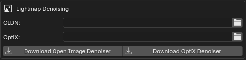

- **Download Open Image Denoiser** installs [Intel Open Image Denoise](https://github.com/RenderKit/oidn) 2.5.1, including its required DLLs, inside the add-on's `denoisers` folder.
- **Download OptiX Denoiser** installs [Declan Russell's](https://github.com/DeclanRussell/NvidiaAIDenoiser) compatible `Denoiser.exe` in the same folder.

Downloaded executables become the defaults automatically. A manually selected path always takes precedence. Internet access and write permission to the installed add-on directory are required for downloading.

External denoising is optional, and installing **either** backend is sufficient—you do not need both. The download buttons install 64-bit Windows builds. OptiX also requires a compatible NVIDIA GPU and driver; release 3.0 requires NVIDIA driver 565 or newer. On other operating systems, choose a compatible OIDN executable manually where supported; the supplied OptiX adapter expects the Windows `Denoiser.exe` application.

These denoisers are currently used only by PsychoVertexMaster's custom lightmapping workflow; they do not affect Blender renders or other add-on tools. More denoising uses may be added later. **OIDN is preferred when external denoising is enabled** because it provides the dedicated `RTLightmap` filter used by this workflow.

Both downloads come directly from third-party GitHub releases and are not developed or bundled by PsychoVertexMaster. [Intel Open Image Denoise](https://github.com/RenderKit/oidn) is distributed under Apache 2.0; [Declan Russell's NVIDIA AI Denoiser](https://github.com/DeclanRussell/NvidiaAIDenoiser) is distributed under the MIT License. Their upstream requirements and licenses apply.

### Updates

PsychoVertexMaster checks the repository's latest stable GitHub Release in the background shortly after Blender starts. When a newer version is available, the update dialog provides:

- **Update** to validate and install the release;
- **Cancel** to leave the current installation unchanged;
- **Don't show again for this update** to suppress that exact release while allowing alerts for later releases.

Use **Check for Updates** at any time for a manual check. **Automatic Alerts** is enabled by default; turn it off to disable startup update checks and dialogs completely. Manual checks continue to work while automatic alerts are disabled.

Updates preserve downloaded denoisers and local backup data. After a successful installation, restart Blender to load the new version. Release tags must match the version embedded in the add-on, so only properly versioned stable releases are accepted.

---

## Installation

### Blender compatibility

- General add-on metadata declares Blender 3.0 or newer.
- The complete custom lightmapping workflow requires Blender 4.2 or newer because passthrough materials use the Cycles Ray Portal BSDF.
- Features that do not use Ray Portal may continue to work on earlier versions, but should be tested against the exact Blender release.

1. Click **Code → Download ZIP** on this GitHub repository.
2. Ensure the ZIP contains the PsychoVertexMaster folder with its root `__init__.py`.
3. Open Blender.
4. Go to **Edit → Preferences → Add-ons**.
5. Choose **Install from Disk** and select the ZIP.
6. Enable **PsychoVertexMaster**.
7. Move your cursor over a 3D View and press <kbd>D</kbd> or <kbd>W</kbd>.

### Updating

Use **Check for Updates** in the add-on preferences, or accept an automatic update alert. Restart Blender after installation. You can still update manually by disabling or removing the previous version, installing the new release ZIP, and restarting Blender.

---

## Optional integrations

The core toolkit works without these add-ons. Install them only for the related actions.

| Integration | What it unlocks |
| --- | --- |
| [EdgeFlow](https://github.com/BenjaminSauder/EdgeFlow) | **Set Flow** for selected edge loops. |
| Blender for Unreal | The **To Unreal** setup, export flags, and path tools. |
| Blender FBX importer/exporter | FBX import, export, and separate `SM_` batch export. Usually bundled with Blender. |

Some tools rely on Blender-version-specific API features. If an action fails, include your exact Blender version when reporting it.

---

## FAQ

<strong>Is PsychoVertexMaster free?</strong>

Yes. It is free and open source under the MIT License.

<strong>Do I need every optional integration?</strong>

No. The related menu action is the only part that needs it. The rest of the add-on remains useful on its own.

<strong>Can I use normal menus instead of pie menus?</strong>

Yes. Change **Mode** in the add-on preferences from **Pie Menus** to **Normal Menus**.

<strong>Why does a tool depend on selection or mode?</strong>

PsychoVertexMaster is context-aware. Mesh-editing actions expect Edit Mode, object organization actions expect Object Mode, and several tools use the active object as their source or target.

<strong>How should I report a bug?</strong>

Include your Blender version, operating system, current mode, selection, the action you ran, what you expected, and the complete console error. A small sample `.blend` is especially helpful when it can be shared safely.

---

## Contributing

PsychoVertexMaster grows around real production needs. Helpful contributions include:

- focused bug reports with reproducible steps;
- small fixes that preserve existing workflows;
- usability improvements for repeated Blender tasks;
- documentation and screenshots;
- compatibility updates for newer Blender releases.

If PsychoVertexMaster saves you time, consider starring the repository and sharing it with another Blender artist.

---

## License

PsychoVertexMaster is released under the [MIT License](LICENSE). You may use, modify, and redistribute it under the license terms.

### Free tools. Faster workflows. More time to create.

**Press <kbd>D</kbd>. Make Blender handier.**

